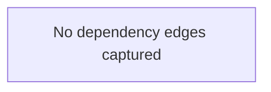

# NuGet Audit Report - NPOIHelper

- Snapshot ID: `20260404180224_7c63f69e`
- Captured UTC: `2026-04-04T18:02:24.8182051+00:00`
- Solution: `C:\Users\windo\OneDrive\Documents\Development\General\NPOIHelper\NPOIHelper.csproj`
- Source identity key: `45E7DFFD94DD69AC`
- Source identity kind: `disk-path`
- Source machine: `SURFACELAPTOP7`
- Repository root: `C:\Users\windo\OneDrive\Documents\Development\General\NPOIHelper`
- Git remote: `-`
- Analysis status: `Partial`
- Projects analysed: `1`
- Packages discovered: `1`
- Direct packages: `1`
- Transitive packages: `0`
- Dependency edges: `0`
- Error diagnostics: `0`
- Warning diagnostics: `0`
- Delta changed: `False`
- Knowledge snapshot generated: `2026-04-04T18:02:24.8182051+00:00`

## Attention Required

No package diagnostics require attention.

## Change Summary

No previous accepted snapshot was available for comparison.

## Knowledge Changes

No newly determined package-knowledge changes were recorded during this analysis.

## Security and Health Transitions

No package health transitions were detected relative to the previous accepted snapshot.

## Dependency Relationship Changes

No dependency edge changes were detected relative to the previous accepted snapshot.

## Project Details

### NPOIHelper

- Path: `C:\Users\windo\OneDrive\Documents\Development\General\NPOIHelper\NPOIHelper.csproj`
- Style: `PackageReference`
- Load state: `Loaded`
- Analysis status: `Partial`
- Target frameworks: `.NETFramework`
- Warnings:
  - Neither obj/project.assets.json nor packages.lock.json was found; the resolved package graph may be incomplete.

| Package | Kind | Requested | Resolved | Health | Vulnerability Detail | Risk | Alert | Knowledge Determined | Status Changed | Remediation | Central | Parents | Path | TFM |
|---|---|---|---|---|---|---|---|---|---|---|---|---|---|---|
| NPOI | Direct | 2.5.2 | - | ok | - | 31.10 (Medium) | 44.00 (Medium) | 2026-04-04T18:02:24.8182051+00:00 | - | - | No | - | - | .NETFramework |

#### Dependency Graph Table

No dependency edges were captured for this project.

#### Dependency Graph Mermaid

## Snapshot Warnings

- Neither obj/project.assets.json nor packages.lock.json was found; the resolved package graph may be incomplete.
