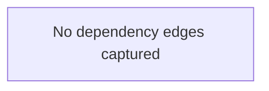

# NuGet Audit Report - NPOIHelper

- Snapshot ID: `20260405125519_0a313603`
- Captured UTC: `2026-04-05T12:55:19.3416985+00:00`
- Solution: `C:\Users\windo\OneDrive\Documents\Development\General\NPOIHelper\NPOIHelper.csproj`
- Source identity key: `45E7DFFD94DD69AC`
- Source identity kind: `disk-path`
- Source machine: `SURFACELAPTOP7`
- Repository root: `C:\Users\windo\OneDrive\Documents\Development\General\NPOIHelper`
- Git remote: `-`
- Analysis status: `Partial`
- Projects analysed: `1`
- Packages discovered: `1`
- Direct packages: `1`
- Transitive packages: `0`
- Dependency edges: `0`
- Error diagnostics: `0`
- Warning diagnostics: `1`
- Delta changed: `False`
- Knowledge snapshot generated: `2026-04-05T12:55:19.3416985+00:00`

## Attention Required

| Severity | Project | Package | Message | .NET version |
|---|---|---|---|---|
| Warning | NPOIHelper | NPOI | Package 'NPOI' 2.5.2 is outdated. Latest compatible stable version: 2.7.6. | net48 |

## Change Summary

No previous accepted snapshot was available for comparison.

## Knowledge Changes

| Package | Version | Determined UTC | Previous Health | Current Health | Risk | Alert | Remediation | Summary |
|---|---|---|---|---|---|---|---|---|
| NPOI | 2.5.2 | 2026-04-05T12:55:19.3416985+00:00 | ok | outdated->2.7.6 | 32.30 (Medium) | 43.40 (Medium) | Upgrade to 2.7.6. | Newer stable version available: 2.7.6. Development status is now Active. Remediation guidance changed. |

## Security and Health Transitions

No package health transitions were detected relative to the previous accepted snapshot.

## Dependency Relationship Changes

No dependency edge changes were detected relative to the previous accepted snapshot.

## Project Details

### NPOIHelper

- Path: `C:\Users\windo\OneDrive\Documents\Development\General\NPOIHelper\NPOIHelper.csproj`
- Style: `PackageReference`
- Load state: `Loaded`
- Analysis status: `Partial`
- .NET version: `net48`
- Warnings:
  - Neither obj/project.assets.json nor packages.lock.json was found; the resolved package graph may be incomplete.
- Diagnostics:
  - [Warning] Package 'NPOI' 2.5.2 is outdated. Latest compatible stable version: 2.7.6.

| Package | Kind | Requested | Resolved | Health | Vulnerability Detail | Risk | Alert | Knowledge Determined | Status Changed | Remediation | Central | Parents | Path | .NET version |
|---|---|---|---|---|---|---|---|---|---|---|---|---|---|---|
| NPOI | Direct | 2.5.2 | - | outdated->2.7.6 | - | 32.30 (Medium) | 43.40 (Medium) | 2026-04-05T12:55:19.3416985+00:00 | 2026-04-05T12:55:19.3416985+00:00 | Upgrade to 2.7.6. | No | - | - | net48 |

#### Dependency Graph Table

No dependency edges were captured for this project.

#### Dependency Graph Mermaid

## Snapshot Warnings

- Neither obj/project.assets.json nor packages.lock.json was found; the resolved package graph may be incomplete.
- One or more NuGet package project URL reachability checks failed (network, timeout, or TLS). Abandoned-package inference may be less accurate.
- Attention required: 1 package diagnostics are warnings.
